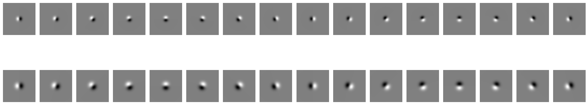
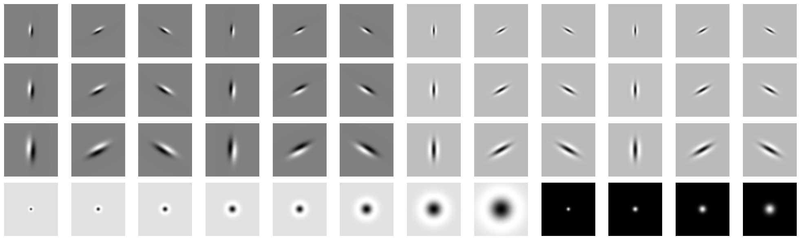

# Probability based boundary detection
A probability based boundary(or edge) detection algorithm is implemented. Unlike the the classical edge detection algorithms like Canny and Sobel which look for only the intensity discontinuities, the probability of boundary (pb) detection algorithm considers the texture and color discontinuties in addition. This gives the algorithm a better performance compared to the baseline (Canny and Sobel) algorithms. Check the full problem statement [here](https://rbe549.github.io/spring2024/hw/hw0/#sub) for additional details. 

## Input image

## Filter banks
Filter banks contain a list of filters that are applied to the input image to extract various features in it. In this project three filter banks are implemented: DoG filters, Leung-Malik filters and Gabor filters. These help us in measuring and aggregating the regional texture and brightness properties.
### Oriented Derivative of Gaussian Filters

### Leung-Malik Filters:

### Gabor Filters:

 
## Texton map

## Brightness map

## Color map

## Gradients

## Baselines

## Final Pb-lite output

## Steps to run the code

## References
Arbelaez, Pablo, et al. "Contour detection and hierarchical image segmentation." IEEE transactions on pattern analysis and machine intelligence 33.5 (2010): 898-916.
