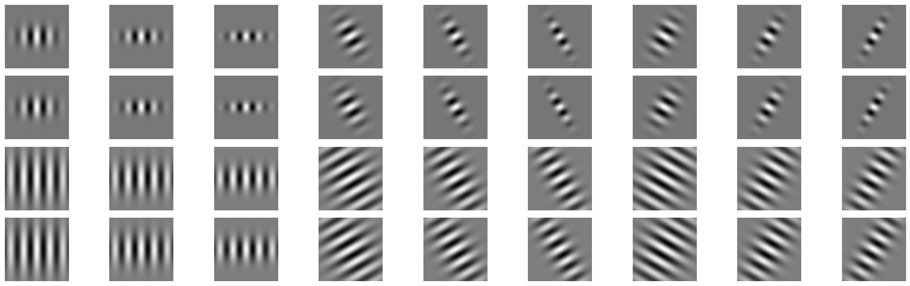

# Probability based boundary detection
A probability based boundary(or edge) detection algorithm is implemented. Unlike the the classical edge detection algorithms like Canny and Sobel which look for only the intensity discontinuities, the probability of boundary (pb) detection algorithm considers the texture and color discontinuties in addition. This gives the algorithm a better performance compared to the baseline (Canny and Sobel) algorithms. Check the full problem statement [here](https://rbe549.github.io/spring2024/hw/hw0/#sub) for additional details. 

## Input image

## Filter banks
Filter banks contain a list of filters that are applied to the input image to extract various features in it. In this project three filter banks are implemented: DoG filters, Leung-Malik filters and Gabor filters. These help us in measuring and aggregating the regional texture and brightness properties.
### Oriented Derivative of Gaussian Filters

### Leung-Malik Filters:

### Gabor Filters:

 
## Texton map
After applying all the filters shown above, we have a list of filter responses. For each pixel in the image we have a vector of filter responses that encodes the texture properties in that region. We cluster these vectors corresponding to each pixel to group together the pixels with similar texture properties. In this case we use K-mean algorithm(with K=64) to get the final texton map.

## Brightness map
Similarly the image was converted to gray scale and clustered the pixels with similar brightness values to generate brightness map.

## Color map
The image has three color channels at each pixel location. We cluster the pixels with similar color property together to generate the color map.

## Gradients
To calculate the oriented gradients of each map we need to get the difference between pixels at different directions and sizes(or scales). We can do these calulations efficiently by convolving the half disc masks shown below with the map. By using this approach we calculate the chi-square distances for each map.
### Half-disc Masks
 

## Baselines

## Final Pb-lite output

## Steps to run the code

## References
Arbelaez, Pablo, et al. "Contour detection and hierarchical image segmentation." IEEE transactions on pattern analysis and machine intelligence 33.5 (2010): 898-916.
